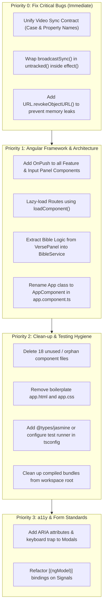

# 📋 Comprehensive Angular Code Review: Presentation Controller

> **Application Overview:**  
> Presentation Controller is an Angular 22 standalone application with Zoneless Change Detection (`provideZonelessChangeDetection`), Tailwind CSS, and a dual-window multi-display architecture using `BroadcastChannel`. It serves live presenters, churches, and event speakers by synchronizing lyrics, Bible scriptures, count-up/down timers, and media assets between a controller interface and an audience-facing presentation stage (`#/present-view`).

---

## 📊 1. Executive Summary & Scorecard

| Evaluation Dimension | Score | Status | Key Verdict |
| :--- | :---: | :---: | :--- |
| **Architectural Design & Structure** | **5.5 / 10** | ⚠️ Needs Work | Inconsistent folder structure (`features/` vs `components/`), 18+ orphaned components, unused CLI boilerplate files. |
| **Modern Reactivity & Signals** | **6.5 / 10** | ⚠️ Needs Work | Zoneless change detection enabled, but `OnPush` is missing on major components; side-effect leakage inside `effect()` causes continuous `localStorage` writes. |
| **Component Design & Typing** | **6.0 / 10** | ⚠️ Needs Work | Critical runtime contract bug in video playback via `BroadcastChannel`; template `$any` casts; business logic mixed into components. |
| **Routing & Performance** | **6.0 / 10** | ⚠️ Needs Work | No route-level code splitting (`loadComponent` missing); monolithic bundle (~572 kB initial); unthrottled 250ms timers. |
| **Forms & Two-Way Binding** | **6.5 / 10** | ⚠️ Needs Work | Anti-patterns mixing `[(ngModel)]` directly with Signals and unmanaged mutable state. |
| **Testing, Tooling & Build Hygiene** | **3.0 / 10** | 🚨 Critical | `npx tsc --noEmit` fails due to missing test runner types; broken unit test; root directory polluted with compiled bundles; no linter. |
| **Accessibility (a11y)** | **5.0 / 10** | ⚠️ Needs Work | Missing ARIA attributes on modals and icon buttons; mouse-only drag selection; no keyboard focus traps. |

---

## 🚨 2. Critical Functional & Architectural Bugs

### 2.1 Video Synchronization Contract Breakdown via `BroadcastChannel`
A severe contract mismatch between [`PresentationStateService`](file:///C:/Workspaces/present/src/app/services/presentation-state.service.ts#L855-L902) and [`PresentationViewComponent`](file:///C:/Workspaces/present/src/app/components/presentation-view/presentation-view.component.ts#L267-L277) prevents video actions from executing:

* In **[`PresentationStateService`](file:///C:/Workspaces/present/src/app/services/presentation-state.service.ts#L861)**:
  ```typescript
  // Service sends UPPERCASE actions and `currentTime` property:
  this.broadcastChannel.postMessage({
    type: 'VIDEO_ACTION',
    action: isPlaying ? 'PLAY' : 'PAUSE', // <-- UPPERCASE
  });
  this.broadcastChannel.postMessage({
    type: 'VIDEO_ACTION',
    action: 'SEEK',                       // <-- UPPERCASE
    currentTime: time,                    // <-- property is `currentTime`
  });
  ```
* In **[`PresentationViewComponent`](file:///C:/Workspaces/present/src/app/components/presentation-view/presentation-view.component.ts#L271-L276)**:
  ```typescript
  // View checks lowercase actions and expects `data.time`:
  if (data.action === 'play') video.play().catch(() => {}); // FAILS: action is 'PLAY'
  else if (data.action === 'pause') video.pause();          // FAILS: action is 'PAUSE'
  else if (data.action === 'seek' && typeof data.time === 'number') video.currentTime = data.time; // FAILS
  ```
* **Root Cause**: `BroadcastChannel` payloads are untyped (`any`).
* **Angular Standard**: Define a strongly-typed discriminated union for all inter-window communication in [`src/app/models/presentation.models.ts`](file:///C:/Workspaces/present/src/app/models/presentation.models.ts).

---

### 2.2 Unintended Signal Dependency & LocalStorage Write Storm
In [`PresentationStateService.constructor`](file:///C:/Workspaces/present/src/app/services/presentation-state.service.ts#L257-L295), an `effect()` handles persistence:
```typescript
effect(() => {
  const currentTab = this.activeTab();
  // ...
  this.storage.setLocal(SETTINGS_STORAGE_KEY, stateToSave);

  if (this.isPresented()) {
    this.broadcastSync(); // <-- Reads remainingSeconds(), activeContent(), etc.
  }
});
```
* **The Problem**: In Angular, **any signal read synchronously during the execution of an `effect()` becomes a dependency of that effect**. Inside `broadcastSync()`, [`this.remainingSeconds()`](file:///C:/Workspaces/present/src/app/services/presentation-state.service.ts#L713) is evaluated.
* During live countdowns, `remainingSeconds` updates every 1 second. This causes the **entire `effect()` to re-execute every second**, serializing and writing the complete application state to `localStorage` continuously throughout the presentation.
* **Angular Standard**: Use `untracked()` from `@angular/core` when calling helper methods or reading signals inside `effect()` that should not trigger re-execution:
  ```typescript
  if (this.isPresented()) {
    untracked(() => this.broadcastSync());
  }
  ```

---

### 2.3 Memory Leak via Unrevoked Object URLs
In [`PresentationStateService.addMediaFile`](file:///C:/Workspaces/present/src/app/services/presentation-state.service.ts#L539) and [`loadSavedMedia`](file:///C:/Workspaces/present/src/app/services/presentation-state.service.ts#L503), blob URLs are generated using `URL.createObjectURL(file)`.
* When items are deleted via [`removeMediaFile(id)`](file:///C:/Workspaces/present/src/app/services/presentation-state.service.ts#L548-L551), `URL.revokeObjectURL(item.dataUrl)` is never invoked.
* Because media blobs remain allocated in browser memory for the lifetime of the session, uploading/deleting large video and image files will cause memory bloating.

---

## ⚙️ 3. Modern Angular Standards, Signals & Zoneless Architecture

### 3.1 Zoneless Change Detection Without `OnPush`
In [`src/app/app.config.ts`](file:///C:/Workspaces/present/src/app/app.config.ts#L8), zoneless change detection is configured:
```typescript
providers: [
  provideZonelessChangeDetection(),
  provideRouter(routes, withHashLocation()),
]
```
However, the primary components omit `changeDetection: ChangeDetectionStrategy.OnPush`:
* [`ControllerComponent`](file:///C:/Workspaces/present/src/app/components/controller.component.ts#L15)
* [`PresentationViewComponent`](file:///C:/Workspaces/present/src/app/components/presentation-view/presentation-view.component.ts#L25)
* [`TextPanelComponent`](file:///C:/Workspaces/present/src/app/components/input-panels/text-panel/text-panel.component.ts#L11)
* [`VersePanelComponent`](file:///C:/Workspaces/present/src/app/components/input-panels/verse-panel/verse-panel.component.ts#L18)
* [`TimerPanelComponent`](file:///C:/Workspaces/present/src/app/components/input-panels/timer-panel/timer-panel.component.ts#L7)
* [`LyricsPanelComponent`](file:///C:/Workspaces/present/src/app/components/input-panels/lyrics-panel/lyrics-panel.component.ts#L18)
* [`MediaPanelComponent`](file:///C:/Workspaces/present/src/app/components/input-panels/media-panel/media-panel.component.ts#L7)

> **Angular Standard**: In Angular 18+ zoneless applications, components should explicitly declare `changeDetection: ChangeDetectionStrategy.OnPush` to ensure predictable notification-based change propagation and prevent unnecessary subtree traversals.

---

### 3.2 Template Function Calls vs. Computed Signals
Multiple templates bind directly to component methods instead of reactive `computed()` signals:
* [`CommonActionsComponent`](file:///C:/Workspaces/present/src/app/components/common-actions/common-actions.component.ts#L24): `[style.width.%]="progressPercent()"` calls a method re-evaluating calculations on change detection passes.
* [`MediaPanelComponent`](file:///C:/Workspaces/present/src/app/components/input-panels/media-panel/media-panel.component.ts#L140): `{{ formatTime(state.videoCurrentTime()) }}` calls a formatting method repeatedly.
* **Angular Standard**: Replace template method bindings with `computed(() => ...)` signals or pure pipes (e.g., a reusable `FormatDurationPipe`).

---

### 3.3 Redundant Polling & Dual Timer Calculations
Both [`PresentationViewComponent`](file:///C:/Workspaces/present/src/app/components/presentation-view/presentation-view.component.ts#L152-L154) and [`PresentationCanvasComponent`](file:///C:/Workspaces/present/src/app/shared/components/presentation-canvas/presentation-canvas.component.ts#L165-L167) run independent `setInterval(..., 250)` timers executing nearly identical time-string formatting algorithms:
* In [`PresentationCanvasComponent`](file:///C:/Workspaces/present/src/app/shared/components/presentation-canvas/presentation-canvas.component.ts#L162), `liveTick = signal<number>(Date.now())` updates every 250ms **regardless of whether the active content is a timer or plain text**.
* This triggers re-computation of `timerString()` and `isCountdownUnder10()` 4 times per second continuously throughout the entire app lifecycle.
* **Angular Standard**: Encapsulate timer ticking into a single dedicated `TimerService` or activate intervals conditionally only when `activeContent().type === 'TIMER'`. Clean up intervals via Angular's `DestroyRef.onDestroy()`.

---

## 🏛️ 4. Component Architecture & Style Guide Compliance

### 4.1 Naming Conventions and Orphan Boilerplate
* **Component Class & Filename**:
  * [`src/app/app.ts`](file:///C:/Workspaces/present/src/app/app.ts#L10) declares `export class App {}`.
  * **Angular Style Guide (Rule [G-01 / G-02])**: Component classes must have the `Component` suffix (`AppComponent`), and filenames must follow the pattern `app.component.ts`.
* **Unused CLI Boilerplate**:
  * [`src/app/app.html`](file:///C:/Workspaces/present/src/app/app.html) (345 lines of default CLI starter SVG and links) and [`src/app/app.css`](file:///C:/Workspaces/present/src/app/app.css) are present in the repository, but [`App`](file:///C:/Workspaces/present/src/app/app.ts#L8) uses an inline template `template: '<router-outlet></router-outlet>'`. These files are dead code.

---

### 4.2 Inconsistent Directory Architecture
* **Structural Division**:
  * Components reside in `src/app/components/`.
  * However, [`on-air-badge.component.ts`](file:///C:/Workspaces/present/src/app/features/controller/preview/on-air-badge.component.ts) is isolated in `src/app/features/controller/preview/` with no other features existing.
* **Angular Standard**: Adopt a consistent domain-driven structure:
  ```text
  src/app/
  ├── core/               # Single-instance services, models, tokens
  ├── features/           # Feature views (controller, present-view)
  │   ├── controller/
  │   └── presenter/
  └── shared/             # Reusable UI components, pipes, directives
  ```

---

### 4.3 Extreme Component Fragmentation vs. "God Components"
The codebase displays an imbalance in architectural sizing:
1. **Hyper-fragmentation in Formatting Toolbar**:
   * Controls like [`BoldButtonComponent`](file:///C:/Workspaces/present/src/app/components/formatting-toolbar/font-controls/bold-button.component.ts), `ItalicButtonComponent`, and `UnderlineButtonComponent` are 20-line single-button components that each directly inject `PresentationStateService`.
   * Rather than reusable presentational components, they tightly couple UI buttons to state, producing 25+ files for simple buttons.
2. **"God Component" in [`VersePanelComponent`](file:///C:/Workspaces/present/src/app/components/input-panels/verse-panel/verse-panel.component.ts)** (405 lines):
   * Mixes scripture algorithmic generation ([`generateRealisticVerseText`](file:///C:/Workspaces/present/src/app/components/input-panels/verse-panel/verse-panel.component.ts#L188)), mouse drag range arithmetic, offline caching, translation selection, and presentation state dispatching.
   * **Angular Standard**: Move scripture generation, lookup, and range parsing to a dedicated `BibleService`.

---

### 4.4 Dead Code & 18+ Orphaned Components
The following components are defined but never imported or referenced in any template:
| Category | Orphaned / Unreferenced Files |
| :--- | :--- |
| **Position Controls** | [`align-bottom-button.component.ts`](file:///C:/Workspaces/present/src/app/components/formatting-toolbar/position-controls/align-bottom-button.component.ts), [`align-center-button.component.ts`](file:///C:/Workspaces/present/src/app/components/formatting-toolbar/position-controls/align-center-button.component.ts), [`align-left-button.component.ts`](file:///C:/Workspaces/present/src/app/components/formatting-toolbar/position-controls/align-left-button.component.ts), [`align-middle-button.component.ts`](file:///C:/Workspaces/present/src/app/components/formatting-toolbar/position-controls/align-middle-button.component.ts), [`align-right-button.component.ts`](file:///C:/Workspaces/present/src/app/components/formatting-toolbar/position-controls/align-right-button.component.ts), [`align-top-button.component.ts`](file:///C:/Workspaces/present/src/app/components/formatting-toolbar/position-controls/align-top-button.component.ts), [`align-h-buttons.component.ts`](file:///C:/Workspaces/present/src/app/components/formatting-toolbar/position-controls/align-h-buttons.component.ts), [`align-v-buttons.component.ts`](file:///C:/Workspaces/present/src/app/components/formatting-toolbar/position-controls/align-v-buttons.component.ts), [`flip-buttons.component.ts`](file:///C:/Workspaces/present/src/app/components/formatting-toolbar/position-controls/flip-buttons.component.ts), [`flip-horizontal-button.component.ts`](file:///C:/Workspaces/present/src/app/components/formatting-toolbar/position-controls/flip-horizontal-button.component.ts), [`flip-vertical-button.component.ts`](file:///C:/Workspaces/present/src/app/components/formatting-toolbar/position-controls/flip-vertical-button.component.ts), [`offset-controls.component.ts`](file:///C:/Workspaces/present/src/app/components/formatting-toolbar/position-controls/offset-controls.component.ts), [`reset-position-button.component.ts`](file:///C:/Workspaces/present/src/app/components/formatting-toolbar/position-controls/reset-position-button.component.ts) |
| **Font & Animation** | [`font-style-buttons.component.ts`](file:///C:/Workspaces/present/src/app/components/formatting-toolbar/font-controls/font-style-buttons.component.ts), [`duration-slider.component.ts`](file:///C:/Workspaces/present/src/app/components/formatting-toolbar/animation-controls/duration-slider.component.ts), [`ribbon-tabs-header.component.ts`](file:///C:/Workspaces/present/src/app/components/formatting-toolbar/ribbon-tabs-header.component.ts) |
| **Actions** | [`popout-button.component.ts`](file:///C:/Workspaces/present/src/app/components/common-actions/popout-button.component.ts), [`duration-control.component.ts`](file:///C:/Workspaces/present/src/app/components/common-actions/duration-control.component.ts) |

* **Dead properties & methods**:
  * [`ControllerComponent`](file:///C:/Workspaces/present/src/app/components/controller.component.ts#L136-L158): `darkThemes`, `lightThemes`, and `rePresent()` are declared but never bound in the template.
  * [`PresentationViewComponent`](file:///C:/Workspaces/present/src/app/components/presentation-view/presentation-view.component.ts#L257-L265): `handleExit()` is declared but never called.
  * [`HistorySectionComponent`](file:///C:/Workspaces/present/src/app/components/history-section/history-section.component.ts#L130-L134): `formatTime()` is defined but never invoked.

---

## ⚡ 5. Routing, Bundling & Performance

### 5.1 Missing Route-Level Lazy Loading
In [`src/app/app.routes.ts`](file:///C:/Workspaces/present/src/app/app.routes.ts#L5-L9):
```typescript
export const routes: Routes = [
  { path: '', component: ControllerComponent },
  { path: 'present-view', component: PresentationViewComponent },
  { path: '**', redirectTo: '' },
];
```
* Both `ControllerComponent` (including all toolbars, panels, modals, Bible database) and `PresentationViewComponent` are statically imported into the root chunk.
* When the secondary presentation screen is opened at `#/present-view`, it unnecessarily downloads the entire controller logic, toolbar components, and edit panels.
* **Angular Standard**: Use `loadComponent` for standalone route splitting:
  ```typescript
  export const routes: Routes = [
    {
      path: '',
      loadComponent: () =>
        import('./components/controller.component').then((m) => m.ControllerComponent),
    },
    {
      path: 'present-view',
      loadComponent: () =>
        import('./components/presentation-view/presentation-view.component').then(
          (m) => m.PresentationViewComponent
        ),
    },
    { path: '**', redirectTo: '' },
  ];
  ```

---

### 5.2 Direct DOM Manipulation vs Angular Abstractions
Multiple files directly reference global browser DOM APIs rather than Angular's dependency injection abstractions (`DOCUMENT`, `Renderer2`, `ElementRef`):
* In [`ControllerComponent`](file:///C:/Workspaces/present/src/app/components/controller.component.ts#L164-L167): `document.createElement('a')` is used to trigger file downloads.
* In [`TextPanelComponent`](file:///C:/Workspaces/present/src/app/components/input-panels/text-panel/text-panel.component.ts#L166): `document.body.focus()` is called directly.
* In [`FontManagerService`](file:///C:/Workspaces/present/src/app/services/font-manager.service.ts#L18-L22): `document.getElementById(...)` and `document.createElement('link')` are executed directly.
* **Angular Standard**: Inject the `DOCUMENT` token (`inject(DOCUMENT)`) and use `Renderer2` for DOM modifications to guarantee safety and compatibility with SSR/prerendering.

---

### 5.3 Template Type Safety & `$any` Bypasses
* In [`highlight-modal.component.ts`](file:///C:/Workspaces/present/src/app/components/formatting-toolbar/modals/highlight-modal.component.ts#L91) and [`background-modal.component.ts`](file:///C:/Workspaces/present/src/app/components/formatting-toolbar/modals/background-modal.component.ts#L91):
  ```html
  (input)="updateHighlightSolid($any($event.target).value)"
  ```
* Bypasses Angular's strict template compiler (`"strictTemplates": true`).
* **Angular Standard**: Create a typed component handler method:
  ```typescript
  onColorInput(event: Event): void {
    const input = event.target as HTMLInputElement;
    if (input) this.updateHighlightSolid(input.value);
  }
  ```

---

## 🧪 6. Testing, Tooling & Build Environment

### 6.1 Broken Typecheck (`tsc --noEmit`)
Running `npx tsc --noEmit` fails with 6 compilation errors:
```text
src/app/app.spec.ts(4,1): error TS2593: Cannot find name 'describe'.
src/app/app.spec.ts(5,3): error TS2593: Cannot find name 'beforeEach'.
src/app/app.spec.ts(12,3): error TS2593: Cannot find name 'it'.
src/app/app.spec.ts(15,5): error TS2304: Cannot find name 'expect'.
```
* **Cause**: Test runner type definitions (`@types/jasmine` or `@types/jest`) are missing from `package.json`, and no `tsconfig.spec.json` exists.
* Furthermore, [`src/app/app.spec.ts`](file:///C:/Workspaces/present/src/app/app.spec.ts#L18-L23) attempts to query an `h1` containing `'Hello, present'` from `App`, which fails because `App` only contains `<router-outlet>`.

---

### 6.2 Repository Hygiene & Root Directory Pollution
The project root is filled with committed or dumped production build artifacts:
* `dist/`
* `browser/`
* `main-*.js`, `styles-*.css`, `main.js`, `main.js.map`
* `index.html` (duplicate of `src/index.html`)
* `3rdpartylicenses.txt`
* `~$InputBoxDesign.pptx` (temporary office lock file)
* **Angular Standard**: Update `.gitignore` to ignore `/dist`, `/browser`, `*.js`, `*.js.map`, `*.css`, and `*.css.map` in the root workspace. Build outputs should only exist in `dist/`.

---

### 6.3 `package.json` Configuration Issues
In [`package.json`](file:///C:/Workspaces/present/package.json#L28):
* `"typescript": "6.0.3"`: TypeScript 6.0 does not exist; Angular CLI resolves this via bundled compilers, but package managers flag this as invalid.
* Missing scripts: There is no `"test"` or `"lint"` script defined.
* No ESLint / `@angular-eslint` dependencies configured.

---

## ♿ 7. Accessibility (a11y) Findings

1. **Modal Dialogs Lack ARIA Semantics**:
   * [`FontModalComponent`](file:///C:/Workspaces/present/src/app/components/formatting-toolbar/modals/font-modal.component.ts), [`HighlightModalComponent`](file:///C:/Workspaces/present/src/app/components/formatting-toolbar/modals/highlight-modal.component.ts), and [`BackgroundModalComponent`](file:///C:/Workspaces/present/src/app/components/formatting-toolbar/modals/background-modal.component.ts) lack `role="dialog"`, `aria-modal="true"`, and `aria-labelledby`.
   * Pressing `Escape` does not close the modals, and keyboard focus is not trapped within them.
2. **Icon-Only Buttons**:
   * Formatting buttons (bold, italic, quick-align grid, close buttons) rely only on text symbols (`✕`, `▶`, `⟳`, `B`) without `aria-label` attributes for screen readers.
3. **Mouse-Bound Interactions**:
   * Bible verse range selection ([`VersePanelComponent`](file:///C:/Workspaces/present/src/app/components/input-panels/verse-panel/verse-panel.component.ts#L265-L324)) relies exclusively on mouse events (`mousedown`, `mouseenter`, `mouseup`) with no keyboard accessibility for selecting verse ranges.

---

## 🎯 8. Prioritized Remediation Roadmap



### Action Items Checklist

#### Priority 0 (Functional Fixes)
- [ ] Align action constants between [`PresentationStateService`](file:///C:/Workspaces/present/src/app/services/presentation-state.service.ts) and [`PresentationViewComponent`](file:///C:/Workspaces/present/src/app/components/presentation-view/presentation-view.component.ts) (`'PLAY'`, `'PAUSE'`, `'SEEK'`, and `currentTime`).
- [ ] Add `untracked()` in [`PresentationStateService`](file:///C:/Workspaces/present/src/app/services/presentation-state.service.ts#L293) around `this.broadcastSync()` to stop countdowns from writing to `localStorage` every second.
- [ ] Call `URL.revokeObjectURL()` inside `removeMediaFile()`.

#### Priority 1 (Angular Standards & Architecture)
- [ ] Add `changeDetection: ChangeDetectionStrategy.OnPush` across all components.
- [ ] Convert [`app.routes.ts`](file:///C:/Workspaces/present/src/app/app.routes.ts) routes to use `loadComponent: () => import(...)`.
- [ ] Rename [`app.ts`](file:///C:/Workspaces/present/src/app/app.ts) to `app.component.ts` and export `AppComponent`.
- [ ] Move scripture generation and search out of [`VersePanelComponent`](file:///C:/Workspaces/present/src/app/components/input-panels/verse-panel/verse-panel.component.ts) into a dedicated `BibleService`.

#### Priority 2 (Code Hygiene & Tooling)
- [ ] Remove the 18 dead/orphaned component files.
- [ ] Delete unused starter files `src/app/app.html` and `src/app/app.css`.
- [ ] Remove build bundles (`main-*.js`, `styles-*.css`, `browser/`, root `index.html`) from the repository root and add them to `.gitignore`.
- [ ] Add `@types/jasmine` (or test runner equivalent) and configure `tsconfig.spec.json` so `tsc --noEmit` succeeds.

#### Priority 3 (Forms & Accessibility)
- [ ] Replace `$any($event.target).value` in modal templates with typed event handlers.
- [ ] Add `aria-label`, `role="dialog"`, and `aria-modal="true"` to all modals and icon-only triggers.
