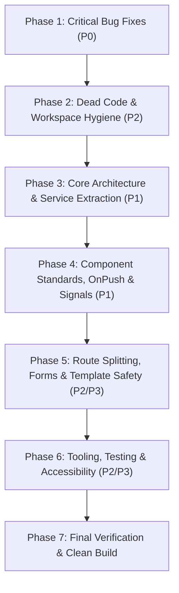

# 🛠️ Angular Remediation Plan & Master Traceability Matrix

> **Project:** Presentation Controller  
> **Reference Document:** [ANGULAR_CODE_REVIEW.md](file:///C:/Workspaces/present/ANGULAR_CODE_REVIEW.md)  
> **Objective:** Systematically remediate 100% of findings identified in the code review without omission, verified via automated gates.

---

## 🧭 Master Execution Flowchart

---

## 📋 Complete Traceability Matrix & Action Plan

### Phase 1: Critical Bug Fixes (Priority 0)
*Goal: Eliminate runtime desync, memory leaks, and write storms.*

| Ref ID | Issue Description | Target Files | Detailed Remediation |
| :---: | :--- | :--- | :--- |
| **1.1** | `BroadcastChannel` Contract Mismatch | [`src/app/models/presentation.models.ts`](file:///C:/Workspaces/present/src/app/models/presentation.models.ts) | Define strongly-typed discriminated unions (`VideoActionMessage`, `SyncStateMessage`, `SyncPositionMessage`, `VideoTimeUpdateMessage`) for all inter-window communication. |
| **1.2** | Video Action Casing & Property Mismatch | [`src/app/services/presentation-state.service.ts`](file:///C:/Workspaces/present/src/app/services/presentation-state.service.ts#L855-L902) [`src/app/components/presentation-view/presentation-view.component.ts`](file:///C:/Workspaces/present/src/app/components/presentation-view/presentation-view.component.ts#L267-L277) | Unify action constants (`'PLAY'`, `'PAUSE'`, `'SEEK'`, `'MUTE'`, `'LOOP'`) and property names (`currentTime` instead of `time`) across service and stage view. |
| **1.3** | `effect()` LocalStorage Write Storm | [`src/app/services/presentation-state.service.ts`](file:///C:/Workspaces/present/src/app/services/presentation-state.service.ts#L257-L295) | Wrap `this.broadcastSync()` inside `untracked(() => this.broadcastSync())` so countdown `remainingSeconds()` does not trigger disk writes every second. |
| **1.4** | Media Object URL Memory Leak | [`src/app/services/presentation-state.service.ts`](file:///C:/Workspaces/present/src/app/services/presentation-state.service.ts#L548-L551) | Call `URL.revokeObjectURL(item.dataUrl)` when deleting media items in `removeMediaFile()`. |

---

### Phase 2: Dead Code & Workspace Hygiene (Priority 2)
*Goal: Eliminate all 18 orphan components and root build clutter before refactoring.*

| Ref ID | Issue Description | Target Files | Detailed Remediation |
| :---: | :--- | :--- | :--- |
| **2.1** | 18 Orphaned / Unused Components | `src/app/components/formatting-toolbar/position-controls/` `src/app/components/formatting-toolbar/font-controls/` `src/app/components/common-actions/` | Delete all 18 unreferenced component files: • `align-bottom-button.component.ts` • `align-center-button.component.ts` • `align-left-button.component.ts` • `align-middle-button.component.ts` • `align-right-button.component.ts` • `align-top-button.component.ts` • `align-h-buttons.component.ts` • `align-v-buttons.component.ts` • `flip-buttons.component.ts` • `flip-horizontal-button.component.ts` • `flip-vertical-button.component.ts` • `offset-controls.component.ts` • `reset-position-button.component.ts` • `font-style-buttons.component.ts` • `duration-slider.component.ts` • `ribbon-tabs-header.component.ts` • `popout-button.component.ts` • `duration-control.component.ts` |
| **2.2** | Unused CLI Boilerplate | `src/app/app.html` `src/app/app.css` | Delete the 345-line starter SVG template and unused empty stylesheet. |
| **2.3** | Dead Properties & Methods | [`src/app/components/controller.component.ts`](file:///C:/Workspaces/present/src/app/components/controller.component.ts) [`src/app/components/presentation-view/presentation-view.component.ts`](file:///C:/Workspaces/present/src/app/components/presentation-view/presentation-view.component.ts) [`src/app/components/history-section/history-section.component.ts`](file:///C:/Workspaces/present/src/app/components/history-section/history-section.component.ts) | Remove unused `darkThemes`, `lightThemes`, `rePresent()`, `handleExit()`, and `formatTime()`. |
| **2.4** | Root Directory Artifact Pollution | `C:\Workspaces\present\` | Delete compiled artifacts in repository root (`main-*.js`, `styles-*.css`, `browser/`, `main.js`, root `index.html`, `~$InputBoxDesign.pptx`). Update [`.gitignore`](file:///C:/Workspaces/present/.gitignore) with `/browser`, `*.js.map`, `*.css.map`. |

---

### Phase 3: Core Architecture, Naming & Service Extraction (Priority 1)
*Goal: Align with Angular Style Guide and Single Responsibility Principle.*

| Ref ID | Issue Description | Target Files | Detailed Remediation |
| :---: | :--- | :--- | :--- |
| **3.1** | Root Component Naming & Filename | [`src/app/app.ts`](file:///C:/Workspaces/present/src/app/app.ts) [`src/main.ts`](file:///C:/Workspaces/present/src/main.ts) [`src/app/app.spec.ts`](file:///C:/Workspaces/present/src/app/app.spec.ts) | Rename `app.ts` to `app.component.ts`, rename class to `AppComponent`, update references in `main.ts` and test specs. |
| **3.2** | Stray Folder / Structure Inconsistency | [`src/app/features/controller/preview/on-air-badge.component.ts`](file:///C:/Workspaces/present/src/app/features/controller/preview/on-air-badge.component.ts) | Move to `src/app/components/live-preview/on-air-badge.component.ts`, update imports, and delete the empty `features/` directory. |
| **3.3** | "God Component" in `VersePanel` | [`src/app/components/input-panels/verse-panel/verse-panel.component.ts`](file:///C:/Workspaces/present/src/app/components/input-panels/verse-panel/verse-panel.component.ts) | Extract scripture generation algorithms, caching, and reference formatting into a dedicated `BibleService` (`src/app/services/bible.service.ts`). |

---

### Phase 4: Zoneless Reactivity, Signals & Timers (Priority 1)
*Goal: Ensure OnPush across all components and eliminate wasteful polling.*

| Ref ID | Issue Description | Target Files | Detailed Remediation |
| :---: | :--- | :--- | :--- |
| **4.1** | Missing `OnPush` Change Detection | All components in `src/app/components/` and `src/app/shared/` | Add `changeDetection: ChangeDetectionStrategy.OnPush` to `ControllerComponent`, `PresentationViewComponent`, `TextPanelComponent`, `VersePanelComponent`, `TimerPanelComponent`, `LyricsPanelComponent`, `MediaPanelComponent`, `VerseToolbarComponent`, and `VerseReferencePickerComponent`. |
| **4.2** | Template Method Calls vs Signals | [`src/app/components/common-actions/common-actions.component.ts`](file:///C:/Workspaces/present/src/app/components/common-actions/common-actions.component.ts) [`src/app/components/input-panels/media-panel/media-panel.component.ts`](file:///C:/Workspaces/present/src/app/components/input-panels/media-panel/media-panel.component.ts) | Convert `progressPercent()` to a `computed()` signal; replace `formatTime(...)` with a computed signal or custom pure pipe. |
| **4.3** | Continuous 250ms Timer Polling | [`src/app/shared/components/presentation-canvas/presentation-canvas.component.ts`](file:///C:/Workspaces/present/src/app/shared/components/presentation-canvas/presentation-canvas.component.ts) [`src/app/components/presentation-view/presentation-view.component.ts`](file:///C:/Workspaces/present/src/app/components/presentation-view/presentation-view.component.ts) | Guard intervals so they only tick when `content().type === 'TIMER'`; de-duplicate timer formatting and manage lifecycle via `DestroyRef`. |

---

### Phase 5: Routing, Forms & Strict Template Safety (Priority 2/3)
*Goal: Enable route-level code splitting and eliminate type bypasses.*

| Ref ID | Issue Description | Target Files | Detailed Remediation |
| :---: | :--- | :--- | :--- |
| **5.1** | Missing Route-Level Code Splitting | [`src/app/app.routes.ts`](file:///C:/Workspaces/present/src/app/app.routes.ts) | Convert routes to `loadComponent: () => import(...)` with descriptive `title` metadata. |
| **5.2** | Template Type Bypasses (`$any`) | [`src/app/components/formatting-toolbar/modals/highlight-modal.component.ts`](file:///C:/Workspaces/present/src/app/components/formatting-toolbar/modals/highlight-modal.component.ts) [`src/app/components/formatting-toolbar/modals/background-modal.component.ts`](file:///C:/Workspaces/present/src/app/components/formatting-toolbar/modals/background-modal.component.ts) | Replace `$any($event.target).value` with typed event handlers (`onColorInput(event: Event)`). |
| **5.3** | Direct DOM Access | [`src/app/components/controller.component.ts`](file:///C:/Workspaces/present/src/app/components/controller.component.ts) [`src/app/services/font-manager.service.ts`](file:///C:/Workspaces/present/src/app/services/font-manager.service.ts) | Inject `DOCUMENT` token (`inject(DOCUMENT)`) for global DOM operations. |
| **5.4** | Signal 2-Way Binding Anti-Pattern | [`src/app/components/input-panels/text-panel/text-panel.component.ts`](file:///C:/Workspaces/present/src/app/components/input-panels/text-panel/text-panel.component.ts) | Refactor `[(ngModel)]="textInput"` to proper signal binding `[ngModel]="textInput()"` `(ngModelChange)="onTextChange($event)"`. |

---

### Phase 6: Tooling, Testing & Accessibility (Priority 2/3)
*Goal: Clean compilation, working unit test, and WCAG a11y compliance.*

| Ref ID | Issue Description | Target Files | Detailed Remediation |
| :---: | :--- | :--- | :--- |
| **6.1** | Broken Typecheck & `app.spec.ts` | [`src/app/app.spec.ts`](file:///C:/Workspaces/present/src/app/app.spec.ts) [`package.json`](file:///C:/Workspaces/present/package.json) [`tsconfig.json`](file:///C:/Workspaces/present/tsconfig.json) | Fix `AppComponent` unit test; add test runner types/config so `npx tsc --noEmit` exits with code 0. |
| **6.2** | Invalid TypeScript Version in `package.json` | [`package.json`](file:///C:/Workspaces/present/package.json#L28) | Set `"typescript"` to a valid, supported version (`~5.7.0` / `~5.6.0`). |
| **6.3** | Modal Accessibility & Keyboard Trap | `font-modal.component.ts` `highlight-modal.component.ts` `background-modal.component.ts` | Add `role="dialog"`, `aria-modal="true"`, `aria-labelledby`, and `Escape` key close listener. |
| **6.4** | Icon-Only Button Labels | All toolbar & action buttons | Add `aria-label` attributes to icon-only buttons across toolbar and panels. |

---

## 🛡️ Verification Gates

| Gate | Check Command / Criteria | Success Condition |
| :--- | :--- | :--- |
| **Gate 1: Static Typecheck** | `npx tsc --noEmit` | **0 errors** across application and test code. |
| **Gate 2: Production Build** | `npm run build` | **0 errors, 0 warnings**; output generates independent lazy chunks for Controller and Stage. |
| **Gate 3: Dead Code Elimination** | File tree inspection | All 18 dead files, 2 starter boilerplate files, and root artifacts removed. |
| **Gate 4: Runtime Synchronization** | Inter-window message test | Video actions (`'PLAY'`, `'PAUSE'`, `'SEEK'`) execute reliably without casing/property errors. |

---

## 🚀 Execution Checklist

- [x] **Phase 1**: Critical Bugs (BroadcastChannel contract, `untracked()` write storm fix, blob URL leak fix).
- [x] **Phase 2**: Dead Code & Hygiene (Delete 18 files, delete boilerplate, remove root build artifacts, update `.gitignore`).
- [x] **Phase 3**: Architecture & Naming (`AppComponent`, relocate `on-air-badge`, create `BibleService`).
- [x] **Phase 4**: Reactivity & Signals (Apply `OnPush`, computed signals, guard timer intervals).
- [x] **Phase 5**: Routing & Templates (Lazy route loading, eliminate `$any`, inject `DOCUMENT`, signal form bindings).
- [x] **Phase 6**: Tooling & a11y (Fix `app.spec.ts`, fix `package.json`, add modal ARIA attributes & keyboard handlers).
- [x] **Phase 7**: Run Verification Gates 1–4.
