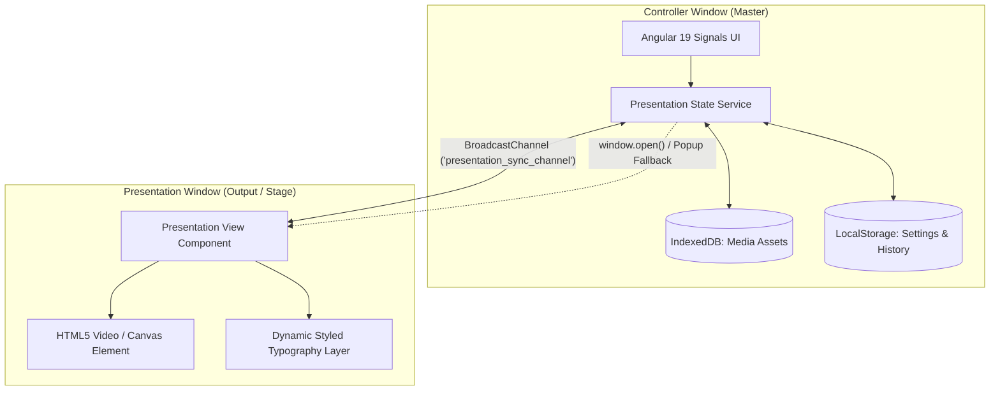

Listed directory present
Listed directory requirement-docs
Viewed AI_CONTEXT.md:1-163
Listed directory 1
Listed directory 2
Listed directory 3
Viewed index.html:1-31
Viewed requirement.md:1-100
Viewed presentation-controller-heuristic-eval.md:1-100
Listed directory features
Viewed appLaunch.feature:1-73
Viewed analyze.js:1-100
Viewed index.html:1-60
Listed directory steps
Viewed app_launch_steps.py:1-53
Listed directory present
Ran command: `git log -n 10 --oneline`
Ran command: `git status`
Viewed features.md:1-100
Viewed Presentation-Controller-Feature-List.md:1-100
Viewed sw.js:1-72
Searched for "presentation"
Viewed main-VGYEYWZ5.js:1-2
Searched for "AppComponent"
Viewed main-VGYEYWZ5.js:20-30

# 🎯 Critical Review: Presentation Controller App

**Application Overview:**
A single-page Progressive Web App (Angular 19 with Signals, Tailwind CSS + OKLCH themes, and BroadcastChannel multi-window architecture) designed for live presenters, churches, educators, and event speakers to project styled text, Scripture verses, live timers, song lyrics, and media assets onto a secondary screen or projector.

---

## 📊 Executive Summary & Scorecard

| Dimension                                |    Rating    | Verdict & Summary                                                                                                                                                                   |
| :--------------------------------------- | :----------: | :---------------------------------------------------------------------------------------------------------------------------------------------------------------------------------- |
| **Product & UX Flow**                    | **8.0 / 10** | High-utility layout with real-time preview and multi-mode tabs (Text, Verse, Timer, Lyrics, Media). Some density and modal-navigation friction remains.                             |
| **Live Presenter Ergonomics**            | **7.5 / 10** | Essential shortcuts (`Enter`, `Esc`, `Space`) are supported, but keyboard navigation through lyrics/stanzas, verse ranges, and timer presets during live speaking needs refinement. |
| **Architecture & Multi-Window Sync**     | **8.5 / 10** | Decoupled architecture using `BroadcastChannel` with fallback state requests. Very fast rendering and zero backend dependency.                                                      |
| **Performance & Asset Handling**         | **7.5 / 10** | IndexedDB storage for offline videos/images is strong; however, the Service Worker cache list omits hashed production bundles, posing offline-first risks.                          |
| **Accessibility (a11y) & Visual Design** | **7.0 / 10** | 10 distinct OKLCH dark/light themes are visually polished. Icon-only controls, screen reader announcements for live status, and focus management need improvements.                 |
| **Robustness & Edge-Case Safety**        | **7.5 / 10** | Safe schema validation on JSON design imports and popup blocker detection exist, but cross-tab broadcast collisions and video format fallbacks require guardrails.                  |

---

## 🔍 Detailed Critical Analysis

### 1. Presenter Workflow & Usability (Heuristic Evaluation)

#### Strengths
* **True Real-time Feedback Loop:** The top preview box mirrors typography, gradients, shadows, text boxes, and background media in real time, preventing mistakes before going live to an audience.
* **Unified Ribbon Architecture:** Grouping typography, text effects (glow, shadow, outline, reflection), and background styles into a persistent top toolbar prevents configuration duplication across tabs.
* **Structured Multi-Domain Panels:** Dedicated panels for Bible Verses (with categorization and quick-lookup grids), Lyrics (with automatic stanza detection), Timers (3 distinct modes), and Media (with live video seek/play/loop controls) match actual church/conference workflows.

#### Usability Gaps & Cognitive Friction
1. **Live vs. Staging Mental Model Confusion:** 
   * Editing text or choosing a lyric verse in the control panel immediately alters the controller state, but changes only propagate to the audience display when explicitly presented or synchronized. While this is the intended workflow, there is no unambiguous indicator (e.g., a green "LIVE ON AIR" badge vs. yellow "STAGED / DRAFT" badge) showing what the audience is viewing right now.
2. **Lyric Stanza Navigation During Singing:**
   * During live worship or music, presenters cannot rely on mouse clicking. Navigating between Stanzas (Verse 1 &rarr; Chorus &rarr; Verse 2) requires hotkeys (`PageDown`/`PageUp` or `ArrowRight`/`ArrowLeft`) to advance seamlessly without looking down at the mouse.
3. **Bible Verse Range Selection:**
   * The verse selector allows single verses or checkbox clicking, but selecting multi-verse passages (e.g., *Romans 8:28–39*) requires either tedious individual clicks or manual text typing. A click-and-drag or shift-click range selector is missing.
4. **Theme Semantics & Action Contrast:**
   * Across the 10 custom themes, some action buttons (e.g., "Clear History", "Save Design", "Hold") share similar color weighting with primary execution buttons ("PRESENT"). Primary live triggers must maintain high chromatic contrast and unmistakable hierarchy.

---

### 2. Architecture, Multi-Window Sync & Data Storage



#### Architectural Strengths
* **Stateless Output Renderer:** The secondary presentation window acts as a pure presentation view, receiving reactive state payloads (`SYNC_STATE`, `SYNC_POSITION`, `VIDEO_ACTION`) over `BroadcastChannel`. If the presentation window is accidentally reloaded or closed and reopened, it broadcasts `REQUEST_STATE` and hydrates in milliseconds.
* **Zero Backend / Serverless Privacy:** Media files, custom fonts, song files, and designs reside completely in the client environment via IndexedDB and LocalStorage, eliminating network bandwidth constraints and cloud latency during events.

#### Critical Architecture Risks
1. **BroadcastChannel Namespace Collisions:**
   * The channel name is hardcoded to `'presentation_sync_channel'`. If an operator opens two distinct controller tabs or two different events on the same origin/browser profile, commands from Tab A will inadvertently hijack Display B.
   * *Recommendation:* Generate a unique session or display ID (e.g., `presentation_sync_channel_${sessionId}`) with a selectable target display channel.
2. **IndexedDB Storage Eviction Under Storage Pressure:**
   * Browsers (especially iOS Safari and Chromium in low-disk scenarios) can evict non-persisted IndexedDB storage.
   * *Recommendation:* Explicitly request `navigator.storage.persist()` on app initialization to grant persistent storage immunity.
3. **Large Base64/Blob URL Serialization:**
   * Transferring raw Base64 data URLs over BroadcastChannel for large video backgrounds can degrade frame rendering on slower laptops.
   * *Recommendation:* Store media exclusively in IndexedDB and transfer only the media record key/ID across the channel, allowing the presentation window to load directly from IndexedDB.

---

### 3. PWA, Service Worker & Offline-First Integrity

#### Identified Issues in [`sw.js`](file:///c:/Workspaces/present/sw.js)
1. **Missing Production Asset Pre-caching:**
   * In [`sw.js:2-9`](file:///c:/Workspaces/present/sw.js#L2-L9), `ASSETS_TO_CACHE` includes only `'./'`, `'./index.html'`, `'./manifest.webmanifest'`, `'./favicon.ico'`, and icons.
   * The hashed Angular bundles (e.g., `main-VGYEYWZ5.js`, `styles-R2GKBWDX.css`) are **not pre-cached** during the `install` event. If a presenter attempts to launch the installed PWA in an auditorium with no Wi-Fi before visiting every sub-route, the app will fail to bootstrap.
2. **Cache-Busting & Stale Script Vulnerability:**
   * The service worker version is hardcoded to `'present-app-v1'` while Angular output filenames use content hashes. Cache-first strategies can lead to stale script-to-style mismatches when redeploying.

---

### 4. Accessibility (a11y) & Visual Polish

* **Screen Reader Status Announcements:** When content transitions to live (`isPresented = true`), assistive technologies receive no ARIA Live announcement (`aria-live="polite"` / `aria-live="assertive"`). Adding an invisible live announcer region (`"Now presenting: John 3:16"`) is essential for accessibility compliance.
* **Color Contrast Across Themes:** While dark themes like `midnight-slate` and `cyber-dark` look modern, subtle text indicators (e.g., `.text-slate-500` and `.text-[10px]` subtext) fall below WCAG 2.1 AA contrast requirements (4.5:1 ratio) in several light themes like `warm-paper`.
* **Focus Traps in Modals:** When opening the "Paste Song Text" modal, focus is not trapped within the dialog, allowing keyboard tab navigation to escape into background controls.

---

## 📋 Prioritized Action Plan & Technical Roadmap

```
High Priority (Immediate Impact)
├── 1. PWA Cache Fix: Add dynamically hashed bundles or runtime asset manifest to sw.js
├── 2. Live On-Air Status Indicator: Add a distinct "ON SCREEN" vs "DRAFT" badge on the preview
├── 3. Worship / Lyrics Live Navigation: Support ArrowUp / ArrowDown / PageDown shortcuts for stanzas
└── 4. Persistent Storage Request: Call navigator.storage.persist() for IndexedDB video assets

Medium Priority (Workflow Enhancements)
├── 5. Scripture Verse Multi-Select: Implement shift-click or drag range selection in VERSE tab
├── 6. Channel Multi-Tenancy: Allow custom broadcast channel names for multi-display setups
├── 7. Focus Trap & ARIA Live: Trap modal focus and announce presentation status changes
└── 8. Google Font Fallback Engine: Handle offline font fallback gracefully with system font stacks

Low Priority (Future Roadmap)
├── 9. NDI / WebRTC Stage Output: Output direct video feed for OBS / vMix streaming software
└── 10. Remote Presenter Webhook: Companion mobile view via WebRTC / Local LAN WebSocket
```

---

## 🏁 Final Verdict

The **Presentation Controller** is a capable, privacy-respecting, and well-designed live broadcasting tool. Its Angular 19 reactive foundation and offline-capable architecture make it fast and responsive. Addressing the PWA caching in `sw.js`, refining live keyboard ergonomics for lyrics/verses, and adding explicit "On-Air" visual state badges will elevate this application to a broadcast-grade presentation suite.