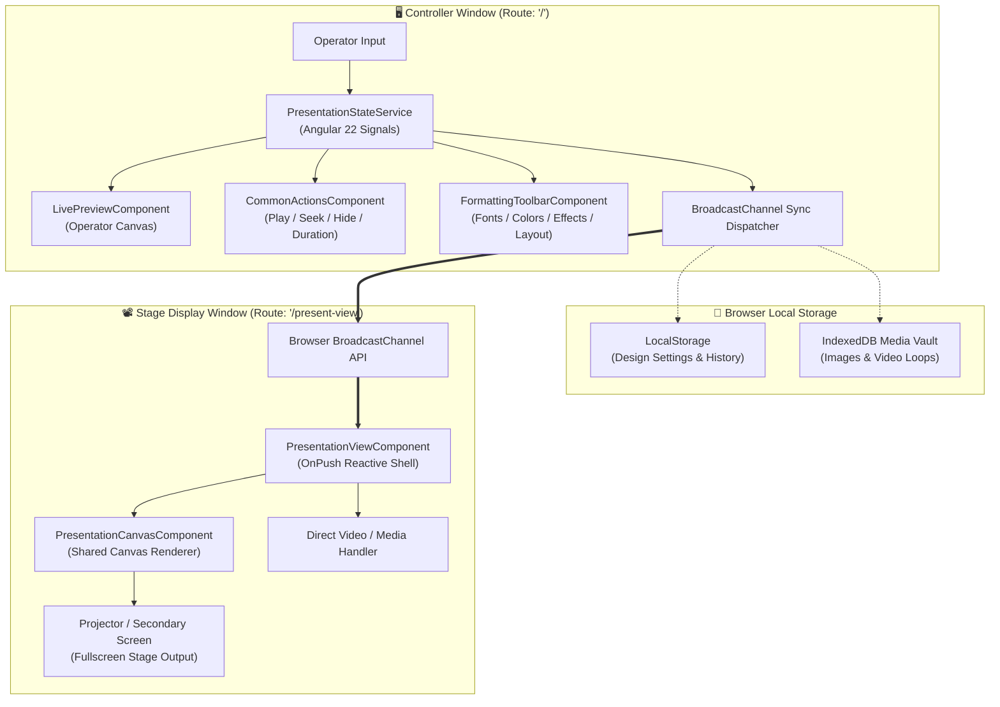

# 📽️ Presentation Controller (Present)

<div align="center">

[](https://angular.dev/)
[](https://www.typescriptlang.org/)
[](https://tailwindcss.com/)
[](https://web.dev/progressive-web-apps/)
[](https://playwright.dev/)
[](LICENSE)
[](https://paypal.me/chrisinhim)

**Modern, ultra-fast, client-side live presentation and multimedia broadcasting software.**  
Engineered with **Angular 22 Zoneless Signals**, dual-window multi-display synchronization, and a desktop-grade formatting engine.

[Live Features](#-key-features) • [Architecture](#-architecture--system-design) • [Quick Start](#-quick-start) • [Input Engines](#-the-5-presentation-engines) • [Keyboard Shortcuts](#-keyboard-shortcuts) • [Testing](#-testing--quality-assurance)

</div>

---

## 🌟 Overview

**Presentation Controller** (short name: **Present**) is a web-based, standalone presentation suite designed for live events, churches, worship gatherings, broadcast studios, classrooms, and conferences. 

Unlike traditional presentation tools that require heavy desktop installations or server accounts, Present runs **100% in your browser** with **zero server dependencies**, **zero latency**, and **offline persistence**. It projects a dedicated, distraction-free stage window onto external projectors or secondary monitors while providing the operator with a high-efficiency control center.

```
┌─────────────────────────────────────────────────────────────┐
│                   OPERATOR CONTROLLER                       │
│  [Live Preview] [Transport Bar] [Formatting Ribbon]         │
│  [TEXT] [VERSE] [TIMER] [LYRICS] [MEDIA]                    │
└──────────────────────────────┬──────────────────────────────┘
                               │  Native BroadcastChannel API
                               │  (Zero Latency / Cross-Window)
                               ▼
┌─────────────────────────────────────────────────────────────┐
│                 STAGE DISPLAY / PROJECTOR                   │
│  • Fullscreen Frameless Canvas                              │
│  • High-DPI Typography, Video Backdrops & Animations        │
└─────────────────────────────────────────────────────────────┘
```

---

## ✨ Key Features

### ⚡ Angular 22 Zoneless Reactivity
- **Signals-First Architecture**: Built on Angular 22 `provideZonelessChangeDetection()` and fine-grained Signals (`signal`, `computed`, `effect`) for instantaneous UI updates without Zone.js runtime overhead.
- **Microsecond Response**: Live changes render instantly in both the operator's preview and the output stage window.

### 🖥️ Zero-Latency Dual-Window Synchronization
- **Native `BroadcastChannel` Transport**: Cross-window communication coordinates live states, video playhead timing, and content switching across browser windows with zero network dependency.
- **Smart Window Launcher**: Auto-detects secondary monitors, handles popup-blocker warnings, and supports one-click window opening with double-click fullscreen toggling.

### 🎨 PowerPoint-Grade Formatting Ribbon
- **Typography Suite**: Built-in system fonts, dynamic live Google Fonts loader, and local font file upload (`.ttf`, `.otf`, `.woff2`).
- **Styling & Effects**: Gradient text fills, adjustable outlines, glowing ambient drop-shadows, reflection, and text case transformation (`UPPERCASE`, `lowercase`, `Capitalize`, `tOGGLE`).
- **Highlight Containers**: Rounded box or text-line backgrounds with customizable opacity, colors, gradients, and padding.
- **Spatial Positioning**: 3×3 alignment matrix (horizontal left/center/right, vertical top/middle/bottom) paired with fine percentage nudge offset sliders (-50% to +50%).
- **Kinetic Animations**: 11 entrance animations (*Fade In, Slide In, Zoom In, Expand, Flip, Blur*) and 11 exit animations with configurable durations.

### 💾 Privacy-First & Offline Storage
- **100% Client-Side**: No telemetry, no tracking, and no external databases.
- **IndexedDB Media Vault**: Images, GIFs, and high-definition video loops are stored locally in the browser with `navigator.storage.persist()`.
- **Portable JSON Profiles**: Save and load complete design styles as standalone `.json` files.

---

## 🎛️ The 5 Presentation Engines

Present offers five specialized input panels tailored for real-time live scenarios:

| Engine | Description | Key Capabilities |
|---|---|---|
| 📝 **TEXT** | Freeform text & announcement broadcasting | • 66 Bible book name autocomplete<br>• Duration auto-hide countdown & seek bar<br>• Multi-line and instant `Enter` key projection |
| 📖 **VERSE** | Dedicated Bible scripture engine | • 66 color-coded canonical books (Law, History, Poetry, Prophets, Gospels, Epistles)<br>• Chapter and verse matrix grid<br>• Click-and-drag multi-verse range selection<br>• **QUOTE** and **REFER** display modes<br>• Multi-translation support |
| ⏱️ **TIMER** | Live broadcast clocks & interval timers | • **Time Now**: 12-hour or 24-hour live clock with seconds toggle<br>• **Countdown**: Target clock time countdown (HH:MM)<br>• **Pomodoro / Stopwatch**: Duration interval timer (MM:SS) with drift-free execution and auto-exit animations |
| 🎵 **LYRICS** | Worship & music lyrics sequencer | • Batch `.txt` file importer<br>• Quick-paste song text with automated stanza parser<br>• Fast keyboard stepping (`PageDown` / `PageUp`) for seamless live song flow |
| 🖼️ **MEDIA** | Dynamic backgrounds & video loops | • Offline IndexedDB media manager<br>• Looping background video playback (MP4, WebM)<br>• Picture and GIF backdrops with `fit`, `fill`, and `original` scaling modes |

---

## 🏗️ Architecture & System Design



### Shared Presentation Canvas
Both the **Live Preview** inside the controller and the **Stage Display** use the identical [`PresentationCanvasComponent`](src/app/shared/components/presentation-canvas/presentation-canvas.component.ts), driven by [`StyleCompilerService`](src/app/core/styles/style-compiler.service.ts). This ensures 100% pixel-accurate WYSIWYG parity between what the operator sees and what is broadcast to the audience.

---

## 🚀 Quick Start

### Prerequisites
- **Node.js**: `v20.x` or higher
- **npm**: `v10.x` or higher
- **Modern Browser**: Chrome, Edge, Firefox, or Safari with popups enabled for dual-screen display

### 1. Clone & Install
```bash
# Clone the repository
git clone https://github.com/chrisinhim/Present.git

# Navigate into the project
cd Present

# Install npm dependencies
npm install
```

### 2. Run Development Server
```bash
npm start
```
Open your browser and navigate to:
```text
http://localhost:4200/
```

### 3. Dual-Screen Setup
1. Click the **Launch Stage Window** button on the transport bar (or navigate to `http://localhost:4200/#/present-view`).
2. If prompted by your browser, **allow pop-ups** for the site.
3. Drag the newly opened Stage Window onto your secondary display / projector.
4. **Double-click** anywhere inside the stage window to switch to frameless fullscreen mode.

---

## ⌨️ Keyboard Shortcuts

| Shortcut | Context | Action |
|---|---|---|
| <kbd>Enter</kbd> | Text / Verse Panels | Present staged content immediately |
| <kbd>Shift</kbd> + <kbd>Enter</kbd> | Text Input Area | Insert a newline into text |
| <kbd>Space</kbd> | Global (inputs blurred) | Toggle Play / Pause on presentation duration |
| <kbd>Esc</kbd> | Global | Instantly **Hide** the presentation with exit animation |
| <kbd>PageDown</kbd> / <kbd>PageUp</kbd> | Lyrics Panel | Advance to next or previous song stanza |
| <kbd>↑</kbd> / <kbd>↓</kbd> | Autocomplete Dropdown | Navigate Bible book suggestions |
| <kbd>Enter</kbd> / <kbd>Tab</kbd> | Autocomplete Dropdown | Accept highlighted suggestion |
| <kbd>Double Click</kbd> | Stage Display Window | Toggle Fullscreen on / off |

---

## 🧪 Testing & Quality Assurance

Present includes an automated end-to-end BDD (Behavior-Driven Development) test suite powered by **Python**, **Behave**, and **Playwright**, covering all primary operator workflows:

### Setting up the E2E Test Suite
```bash
# 1. Install Python test dependencies
pip install -r requirements.txt

# 2. Install Playwright browser binaries
playwright install chromium
```

### Running the Tests
Ensure the Angular application is running (`npm start`), then in a separate terminal:

```powershell
# Headless run against local instance
$env:PRESENT_HEADLESS = 'true'
$env:PRESENT_BASE_URL = 'http://127.0.0.1:4200'
python -m behave test/features/appLaunch.feature --format progress
```

> [!TIP]
> Set `$env:PRESENT_HEADLESS = 'false'` to observe browser automation in real-time while debugging scenarios.

### Unit Tests & Production Build
```bash
# Run Angular production build
npm run build

# Watch mode during development
npm run watch
```

---

## 📁 Repository Structure

```text
present/
├── public/                     # Static assets, PWA manifest, service worker & icons
│   ├── manifest.webmanifest   # Web App Manifest
│   ├── sw.js                  # Service Worker for offline capability
│   └── icons/                 # PWA application icons
├── src/
│   ├── index.html             # Application entry HTML
│   ├── main.ts                # Angular bootstrap entry
│   ├── styles.css             # Tailwind CSS v4 & custom keyframe animations
│   └── app/
│       ├── app.component.ts   # Root router outlet component
│       ├── app.config.ts      # Application config (provideZonelessChangeDetection)
│       ├── app.routes.ts      # Lazy-loaded routes ('/' and '/present-view')
│       ├── core/
│       │   └── styles/        # StyleCompilerService for deterministic CSS generation
│       ├── models/
│       │   ├── presentation.models.ts  # Strongly typed data contracts & messages
│       │   └── bible-data.ts           # Canonical books, verse counts & colors
│       ├── services/
│       │   ├── presentation-state.service.ts # Core state store & BroadcastChannel hub
│       │   ├── bible.service.ts              # Scripture formatting & range logic
│       │   ├── font-manager.service.ts       # Dynamic Google Fonts & local font loader
│       │   └── storage.service.ts            # IndexedDB & LocalStorage persistence
│       ├── shared/
│       │   └── components/
│       │       └── presentation-canvas/      # Shared WYSIWYG rendering engine
│       └── components/
│           ├── controller.component.ts       # Main operator workstation shell
│           ├── live-preview/                 # Mini-preview display with on-air badge
│           ├── common-actions/               # Seekbar, duration, play/pause & hide
│           ├── formatting-toolbar/           # PowerPoint-style ribbon & modal dialogs
│           ├── input-panels/                 # Text, Verse, Timer, Lyrics, Media panels
│           ├── history-section/              # Broadcast history drawer & replay
│           └── presentation-view/            # Fullscreen stage view component
├── test/
│   ├── features/              # Behave feature definitions (appLaunch.feature)
│   └── behave.ini             # Behave configuration
├── angular.json               # Angular CLI & build application config
├── package.json               # Project scripts and dependencies
└── tsconfig.json              # Strict TypeScript configuration
```

---

## 💖 Supporting Present

If you find Presentation Controller helpful for your events, church services, or broadcasts, please consider starring the repository and supporting development:

- **GitHub**: [chrisinhim](https://github.com/chrisinhim)
- **Sponsor / Donate**: [PayPal.me/chrisinhim](https://paypal.me/chrisinhim)

---

## 📄 License

This project is licensed under the [MIT License](LICENSE).
